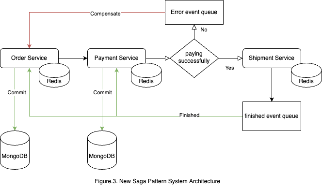

# TCSS-558-Final-Project



use ```paymentSuccess``` flag to contral the payment process successful or not.

## 1.Build up the docker compose
```
docker-compose up
```

## 2.Run Order Service
```
node order.js
```

## 3.Run Payment Service
```
node payment.js
``` 

## 4.Run Shipment Service
```
node shipment.js
```

## 5.Call order API to start the order event
```
curl -X POST http://localhost:4001/order
```